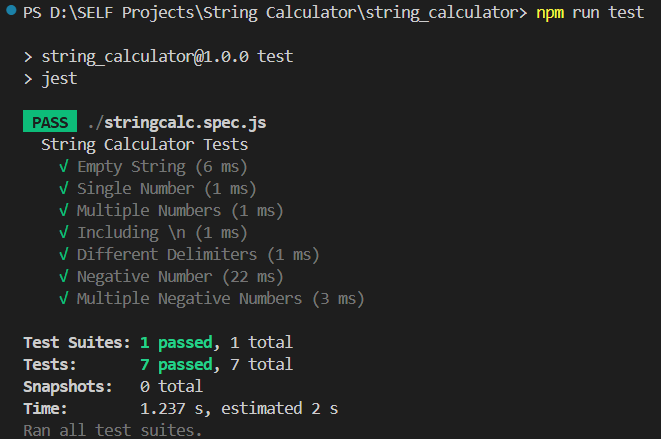

# String Calculator – TDD Kata

"First Fail test then Pass by Fixing code." mean TDD. 

Simple Example to understand the TDD
- In traditional development, Person build the table first, then test if it stands and holds weight.
- With TDD, he first write a test: "The table should stand."
Since it doesn't, he add just enough wood to make it stand.
He repeat this — test, build, adjust — until the table passes all tests.

Here, goal is to iteratively build a calculator that parses a string of numbers and returns their sum using TDD by Jest in JS.


## Cases which evolve code

Each version of the `add()` function corresponds to a new passing test:

1. Empty string returns 0  
2. Single number returns itself  
3. Sum of two numbers  
4. Sum of multiple numbers  
5. Support for newlines  
6. Custom delimiters  
7. Error on negative numbers (with all negatives listed)


## Method Signature

```js
int add(string numbers)
```

**Input:** A string of numbers separated by commas, newlines, or custom delimiters  
**Output:** The integer sum of the numbers

---

## Examples

| Input            | Output | Notes                               |
|------------------|--------|-------------------------------------|
| `""`             | `0`    | Empty string                        |
| `"1"`            | `1`    | Single number                       |
| `"1,2"`          | `3`    | Comma-separated                     |
| `"1\n2,3"`       | `6`    | Mix of comma and newline            |
| `"//;\n1;2"`     | `3`    | Custom delimiter                 |
| `"1,-2,3"`       | Error  | `negative numbers not allowed -2`   |
| `"1,-2,-3"`    | Error  | `negative numbers not allowed -2,-3`|


## Output
